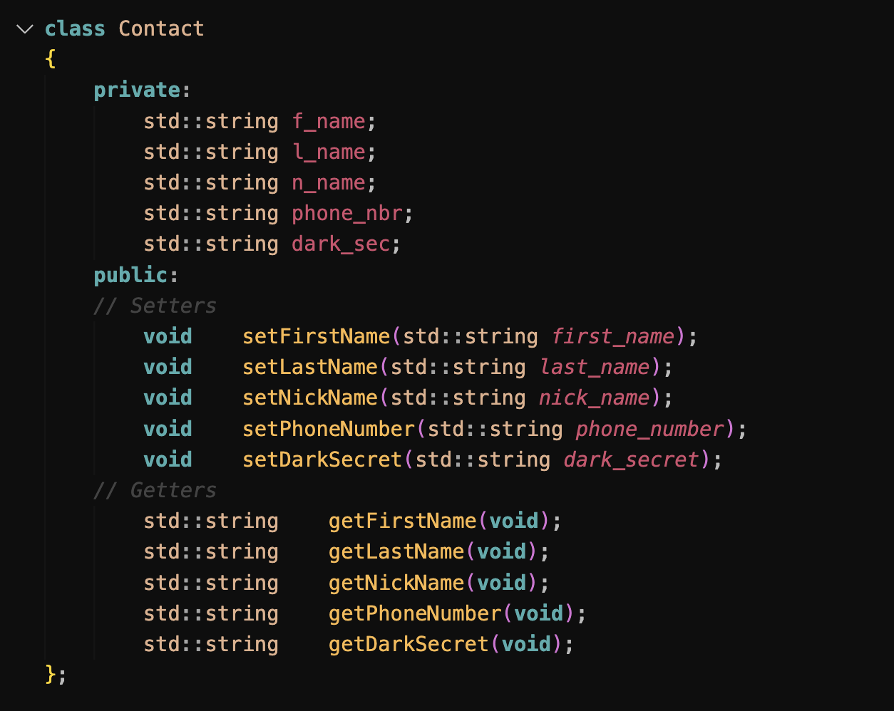

### C++ Module 00
***

***
**This project has been created as part of the 42 curriculum by ayel-bou**
***
#### Description:
This is the first module of CPP Modules, that aims to learn and train on the c++ concepts.
In this Project, you will find two sets of exercises, the first ones aims to take a string as an argument and returns it into Uppercase characters.
As for the last exercise, it aims for creating a PhoneBook that stores 8 contacts, with their fields: **FirstName**, **LastName**, **NickName**, **PhoneNumber** and **DarkSecret**.
Once the number of contacts exceeds 8 contacts, the new contact to be saved will overwrite the oldest contact in the Phonebook.

#### Instructions:
To use or execute any of the exercises, all you have to do is to run the **Make** command, and for the first exercise, you should run the **./megaphone** executable.
And for the last exercise, run **./PhoneBook**.

#### Ai Usage:
Ai was used in this project, in information gathering, understanding some concepts.

#### Resources:
Youtube resources:
[NesoAcademy](https://www.youtube.com/watch?v=1Wrc91mp980) |
[BroCode](https://www.youtube.com/watch?v=-TkoO8Z07hI) | [Ryan Baker](https://www.youtube.com/watch?v=g4Dn2cwSrC4)


As for resources, here is a small brief of all the information needed for this project:

##### * C++ Language ?
C++ is a general-purpouse programming language, as an enhacement of the **C Language**, to add **Object-Oriented paradigm**.
One of the strongest points of the language, is the OOP part.
##### * What is a Class in C++ ?
A Class is a blueprint or a prototype for creating objects.
an object is an instance of the prototype class, that will allow you to use the class's attributes, and methods.
##### * Std c++98 ?
The compiler will follow the rules from c++98 standard, and we cannot use the feature from later versions like, C++11, C++18.
C++98 ensures compilation everywhere, since its the first and oldest version of C++.
Compatibility since some old compilers (or embeded systems) only supports C++98.

The attributes have an **Access Specifiers**:
* Public: Accessible everywhere using the object instance.
* private: Accessible only inside the class, using the methods attributes that are **public** (Setters, Getters).

***

***

In this project, one of the main functionality used, is the **iostream**.

**iosstream**: is a standard library that provides IO and many other facilites.
This library is made up of two types: **istream** for Input stream, and **ostream** for Output stream.
A stream is a sequence of characters read from or written to an IO device.

The Iostream library provides and defines four IO objects:

* cin -> standard input. (istream type)
* cout -> standard output. (ostream type)
* cerr -> standard error. (ostream type)
* clog -> gneral information. (ostream type)

***
The use of **Getline** method from the Std libaray:
The getline method allows us to store the data read from the input stream into a variable.
in this case we used the declared string : **std::string input**, with **getline(std::cin, input)** to store the data coming through the input stream in the input variable.

* note: std::string is an object that gives us multiple methods to manipulate the string variable.
***

Other concepts needed for the project learnings:

* Const: The const keyword specifes that a variable's value is constant, it tells the compiler to prevent anything from modifying it (Read-Only).

(Example From BroCode C++ Video)
```
int main()
{
    const double pi = 3.14;
    doube radius = 10;
    double circumference = 2 * pi * radius;

    std::cout << circumference << "cm";
}
```

In this case, the PI variable is constant, and will raise a compilation error if its value is changed.

* Namespaces: provides a solution for preventing name conflicts in large projects, each entity needs a unique name, a namespace allows the use of the same name multiple entities uses, but in differnet namespace scope, allowing usage without rasing a compilation error.

* Initializator Lists: to understand this concept, we need to know about constructors.
a constructor, is a special function inside a class that's used to initialize an object once it's created, if no constructor is specified, the default constructor is called.
Initializator list, is a way to initilize member variable of a class before the constructor body runs.
It's commonly used with **Const** memebrs, since you can't assign them inside of the constructor body.

* Static: any variablethat uses the static as its declaration or definition, is guarented that its value remain as it is accross the lifetime of running program, as the member will reside in the **Static** Part of the memory unlike **Stack** or **Heap**.
Using a static member method, marks the method is a belonging to the class itself, and it can be used without initializing an object memeber from that class, however a static method cannot access the variable members of the class unless its static alos.

(Example From ChatGpt Ai):
```
class Car {
public:
    int speed;

    void drive() {
        speed += 10;
    }
};
```
Usage:
```
Car c;
c.drive();   // needs an object
```

Static Method:
```
class Car {
public:
    static void honk() {
        std::cout << "Beep!\n";
    }
};
```
Usage:
```
Car::honk();   // no object needed
```
***
This project aims at understanding the basics and fundamentals of C++ Programming.